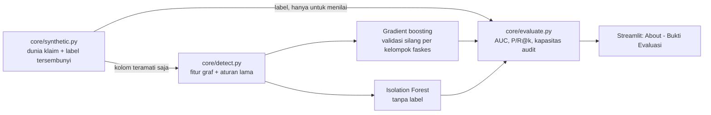

# JALA Fraud Analytics (Streamlit)

[](https://github.com/Yance30/Jala/actions/workflows/ci.yml)

**🔗 Demo live:** https://jala-fraud.streamlit.app/ &nbsp;·&nbsp; data 100% sintetis, tanpa data peserta nyata (sesuai UU PDP).
Muatan pertama bisa ~30 detik karena mesin deteksi membangun cache; setelah itu responsif.

Prototipe untuk **BPJS Kesehatan Healthkathon 2026** (kategori *Efisiensi Risiko pada Fasilitas Kesehatan*): dashboard deteksi kecurangan klaim BPJS Kesehatan lewat **analisis jaringan antar-aktor**
(faskes, dokter, peserta, diagnosis), bukan pemeriksaan klaim satu per satu. Seluruh data **sintetis**
(tidak ada data peserta nyata, sesuai UU PDP).

## Status: apa yang nyata dan apa yang masih ilustrasi

| Bagian | Status |
|---|---|
| `core/synthetic.py`: dunia klaim sintetis berlabel (17,431 klaim, 60 faskes, tiga tipologi fraud + kasus sah yang sengaja mirip fraud) | **Nyata**, seed tetap, diuji |
| `core/detect.py`: fitur graf + skor risiko + penjelasan per klaim | **Nyata**, tidak membaca label (dijaga tes) |
| `core/evaluate.py`: AUC, precision/recall@k, simulasi kapasitas audit | **Nyata**, dihitung ulang saat halaman About dibuka |
| `core/live.py`: klaster Louvain, bukti, subgraf, KPI, dan tren dari skor nyata (dipakai semua layar) | **Nyata**, diuji terhadap label tersembunyi |
| `core/robustness.py`: ablasi fitur, transfer ke dunia bergeser, fraud menghindar, analisis false positive | **Nyata**, hasil di `docs/robustness.json` (dijaga tes agar tidak basi) |
| `core/evidence.py`, `core/whatif.py`, `core/feedback.py`: berkas bukti per klaster, simulasi "dokter dikeluarkan", loop dismiss verifikator | **Nyata**, diuji; umpan balik berupa kalibrasi ringan, belum melatih ulang model |
| `components/tutorial.py`: panduan penggunaan langkah demi langkah | **Nyata**, dicoba di browser |
| `core/modus.py`, `core/contract.py`, `docs/pemetaan-data.md`: posisi modus Healthkathon, batas pembuktian, kontrak dan pemetaan data | **Nyata**, dijaga tes agar tidak menyimpang dari skema |
| About → *Bukti Evaluasi* dan *Uji Ketahanan*, kartu AUC di Claim Details | Tersambung ke hasil nyata |
| KPI, tren mingguan, daftar klaster, subgraf, dan antrean di Dashboard / Risk Ranking / Network Graph / Claim Details / Audit Action | **Dihitung** dari skor nyata lewat `core/live.py`. Yang masih ketikan: teks penjelasan, tombol tindakan, dan konstanta tampilan. Dismiss mengubah skor dan peringkat (kalibrasi ringan, lihat Alat bantu verifikator); freeze dan audit lapangan hanya tercatat di audit trail |
| Arsitektur HAN (Heterogeneous Attention Network) di atas HIN Neo4j | **Arsitektur target**, belum diimplementasikan. Yang diukur saat ini: fitur graf + gradient boosting |

## Bukti dampak, akuntabilitas, dan paket demo

- About menyediakan slider kapasitas mingguan, simulasi salah dismiss, dan audit false positive per tipe faskes/wilayah. Semua hasil ini berasal dari data sintetis.
- Replay waktu deteksi dapat dibuat dengan `python -m core.temporal_impact`; hasil disimpan ke `docs/temporal_impact.json`. Model replay hanya dilatih dari minggu yang sudah lewat, tetapi tetap merupakan simulasi retrospektif sintetis.
- Dokumen untuk penilaian: [model card](docs/model-card.md), [one-pager](docs/one-pager.md), [rencana pilot](docs/pilot-plan.md), dan [latihan tanya jawab](docs/juri-faq.md).
- Coba langsung tanpa instalasi di **https://jala-fraud.streamlit.app/** (Streamlit Community Cloud). Jalankan lokal di Windows dengan `run_demo.bat`, atau bangun Docker dengan `docker build -t jala-demo .` lalu jalankan `docker run --rm -p 8501:8501 -v jala-data:/app/.jala jala-demo`.
- `requirements-lock.txt` dan `requirements-lock-win.txt` mengunci closure dependensi runtime untuk CPython 3.12 di Linux dan Windows. Regenerasi dengan `python scripts/resolve_runtime_lock.py --python-version 3.12 --platform linux` atau `--platform windows` setelah mengubah paket. CI, Docker, dan `run_demo.bat` meng-install dari lock ini (bukan `requirements.txt`), sehingga lingkungan uji identik dengan yang di-deploy; `python scripts/check_lock.py requirements-lock.txt requirements-lock-win.txt` memverifikasi lock masih memenuhi rentang di `requirements.txt`.
- Tampilan peran dan ID peserta tersamar adalah simulasi, bukan autentikasi, kontrol akses, atau bukti kepatuhan UU PDP.

## Kesesuaian dengan BPJS Kesehatan Healthkathon 2026

Tema: *Detect Smarter, Protect JKN*. Challenge: *Efisiensi Risiko pada Pelayanan Kesehatan Program JKN*.
Kategori yang dipilih: **Efisiensi Risiko pada Fasilitas Kesehatan** (satu kategori, tiga modus di dalamnya).

| No. di guidebook | Modus | Definisi di guidebook | Yang ditangkap JALA | Yang tidak bisa dibuktikan JALA |
|---|---|---|---|---|
| 6 | **Phantom billing** (klaim palsu) | Klaim atas layanan yang tidak pernah diberikan | Cincin faskes dengan peserta luar wilayah, klaim dikirim serentak, dan dokter yang sama menagih di banyak faskes dalam 30 menit | Hanya dugaan dari pola; pembuktian lewat pemeriksaan lapangan (lihat Berkas Bukti Klaster) |
| 10 | **Self-referral** (rujukan semu) | Rujukan ke RS/dokter tertentu tanpa alasan keterbatasan fasilitas | Dokter perujuk terdaftar (SIP) di faskes tujuan, konsentrasi rujukan, dan rujukan balik yang membentuk siklus | Keterbatasan fasilitas tidak diketahui: data kapabilitas faskes belum ada, jadi hasilnya prioritas pemeriksaan |
| 11 | **Repeat billing** (klaim berulang) | Klaim diulang pada kasus yang sama yang sudah ditagihkan dan dibayarkan | Peserta dan diagnosis yang sama ditagih lagi dalam hitungan jam, termasuk lintas faskes | Status pembayaran tidak ada di data sintetis, jadi "sudah dibayarkan" belum dimodelkan |

| Ketentuan guidebook | Bagaimana JALA memenuhinya |
|---|---|
| Dilarang memakai data peserta JKN nyata; wajib data dummy atau anonim (butir 5o, bagian 12) | 100% data sintetis (`core/synthetic.py`), tertulis di README dan layar |
| Pemanfaatan AI, data analytics, machine learning (tujuan c) | Fitur graf, gradient boosting, Isolation Forest, deteksi komunitas Louvain |
| Mengidentifikasi, mendeteksi, memitigasi risiko (tujuan b) | Identifikasi dan deteksi diukur (lihat Hasil evaluasi). Mitigasi berupa alur kerja prototipe: freeze, audit lapangan, dismiss, dan berkas bukti; belum terhubung ke sistem BPJS |
| Satu kategori, satu inovasi per tim (butir 5g) | Seluruh fitur berada di Kategori Fasilitas Kesehatan |
| Presentasi dan tanya jawab di final (bagian 9) | Skrip demo dan jawaban juri ada di `DEMO.md` |

Modus lain di kategori yang sama yang mungkin terjangkau pendekatan jaringan (peta jalan, **belum diimplementasikan dan belum diuji**):
pemecahan episode (8), services unbundling (9), readmisi (16), dan klaim fiktif obat/alkes/tindakan (17).

**Posisi JALA: alat prioritas pemeriksaan, bukan pembuktian kecurangan.** Setiap modus punya batas pembuktian yang
ditampilkan di layar (Claim Details dan Audit Action) dan di Berkas Bukti Klaster; definisinya ada di `core/modus.py`.
Aksi *freeze* dan *audit lapangan* adalah simulasi alur: tidak ada pembayaran yang ditangguhkan dan tidak ada sistem BPJS yang dihubungi.

**Pemetaan data.** Skema resmi data klaim BPJS tidak kami ketahui. `docs/pemetaan-data.md` memuat skema sintetis dan padanan
konsepnya (belum dikonfirmasi), kontrak data minimal (`core/contract.py`, dicek otomatis oleh pipeline), kolom yang tidak ada
(nomor SEP, kode INA-CBG, status pembayaran, kapabilitas faskes, dan lainnya), risiko ketelitian waktu, dan tujuh pertanyaan untuk
panitia saat coaching. Guidebook tidak memuat kriteria penilaian.

## Quick start

```bash
pip install -r requirements.txt
streamlit run app.py
# -> http://localhost:8501

pip install -r requirements-dev.txt
pytest -q -m "not e2e"         # tes unit dan smoke (sekitar 1 menit)
playwright install chromium    # sekali saja
pytest -q -m e2e               # tes end-to-end di browser (sekitar 1 menit); dilewati bila Playwright tidak ada
python -m core.evaluate        # tabel metrik di terminal
python -m core.evaluate --seeds 5 --json docs/benchmark.json
python -m core.robustness --json docs/robustness.json   # uji ketahanan, sekitar 90 detik
```

## Tiga tipologi yang disasar

| Tipologi | Pola di graf | Sinyal yang dihitung |
|---|---|---|
| **Phantom Billing** | Cincin klinik menagih peserta fiktif, serentak, oleh dokter yang tercatat praktik di banyak faskes sekaligus | peserta luar wilayah (dinormalisasi per tipe faskes), lonjakan kiriman ±60 detik, satu dokter di beberapa faskes dalam 30 menit, komponen faskes yang terhubung lewat konkurensi dokter |
| **Repeat Billing** | Peserta + diagnosis yang sama ditagih berulang dalam hitungan jam, termasuk lintas faskes konsorsium | jarak waktu ke klaim sebelumnya, klaim ulang < 48 jam, ulang di faskes berbeda |
| **Self-Referral** | Dokter merujuk pasien kronis hampir selalu ke faskes tempat ia juga terdaftar (SIP), plus rujukan balik yang membentuk siklus | porsi rujukan dokter ke faskes terafiliasi, konsentrasi rujukan per dokter, resiprositas antar pasangan faskes |

Kasus sah yang sengaja dibuat mirip fraud (agar detektor tidak menang dengan curang): RS yang mengirim klaim dalam batch
malam, klinik dialisis (pasien kembali tiap ±2,3 hari), kunjungan ulang UGD, lonjakan bencana (pengungsi luar wilayah),
dokter dengan dua tempat praktik (shift pagi/sore) dan dokter daerah yang wajar merujuk ±35% pasien ke RS tempatnya
praktik, serta rujuk balik (PRB).

## Arsitektur



## Hasil evaluasi (seed 2026; 17,431 klaim, 753 fraud = 4.3%)

| Pemberi skor | AUC | Average precision | Fraud tertangkap bila 500 klaim diperiksa | ... bila 1000 klaim | Presisi 250 teratas |
|---|---|---|---|---|---|
| Aturan per klaim (cara lama) | 0.551 | 0.067 | 12.5% | 15.1% | 22.5% |
| Isolation Forest (tanpa label) | 0.974 | 0.679 | 44.0% | 70.0% | 93.2% |
| **JALA: fitur graf + GBM** | 0.996 | 0.930 | 64.8% | 93.4% | 100.0% |
| Acak | 0.500 | 0.043 | 2.9% | 5.7% | 4.3% |

Per tipologi (tipologi itu vs klaim sah):

| Tipologi | Klaim fraud | AUC aturan | AUC Isolation Forest | AUC JALA | AP JALA |
|---|---|---|---|---|---|
| Phantom Billing | 354 | 0.534 | 0.966 | 1.000 | 1.00 |
| Repeat Billing | 222 | 0.594 | 0.967 | 0.991 | 0.58 |
| Self-Referral | 177 | 0.530 | 1.000 | 0.995 | 0.72 |

Stabilitas pada 5 dunia sintetis lain (seed 1-5, rata-rata ± simpangan baku): AUC JALA **0.991 ± 0.010**
(aturan 0.559); fraud tertangkap di 500 klaim **65% ± 2**
(aturan 14%, acak 3%).
Pada 500 klaim teratas JALA, 444 klaim fraud tidak tersentuh aturan lama sama sekali
(aturan lama melewatkan 662 dari 753 fraud).

### Batasan (baca sebelum mengutip angka)

- Data sintetis, dan fraud disisipkan oleh pembangkit yang sama dengan yang membuat fitur-fiturnya. Angka mengukur apakah
  logika deteksi bekerja pada pola yang didefinisikan, **bukan akurasi di data BPJS nyata**.
- Validasi silang per kelompok faskes (cincin yang sama tidak dipakai melatih sekaligus menguji). Hanya ada 8 kelompok fraud,
  sehingga variansnya tinggi; Isolation Forest (tanpa label) sedikit lebih baik dari GBM pada Self-Referral.
- Baseline aturan adalah **asumsi kami** tentang mesin lama (plafon tarif + klaim ganda identik pada hari yang sama).
- Prevalensi fraud sekitar 4% ditentukan pembangkit; precision@k bergantung padanya, recall@k lebih tahan.
- Model yang diukur adalah fitur graf + gradient boosting, bukan GNN/HAN.

## Dari skor ke klaster: layar yang kini dihitung, bukan diketik

`core/live.py` mengubah skor klaim menjadi data layar. Risk Ranking, Claim Details, Network Graph, Audit Action, dan
Dashboard membacanya; daftar klaster, KPI, tren mingguan, graf, dan antrean tidak lagi ditulis tangan
(`data/mock_data.py` kini hanya berisi teks dan konstanta statis).

1. Klaim berskor ≥ 0,5 dianggap ditandai (skor dari validasi silang per kelompok faskes).
2. Dua faskes dihubungkan bila klaim ditandai mengaitkan keduanya (rujukan, dokter yang sama, peserta yang sama);
   sisi dengan bobot < 3 dibuang agar kebetulan tidak menyatukan klaster.
3. Komunitas Louvain pada graf faskes itu menjadi klaster. Skor klaster = rata-rata skor klaim teratasnya.
4. Tipologi dugaan dan bukti diambil dari fitur klaim (`core.detect.explain`), bukan dari label.

Penilaian terhadap label tersembunyi (`evaluate_clusters`, hanya untuk mengukur):

| Ukuran | Hasil |
|---|---|
| Kelompok fraud yang terpulihkan sebagai klaster murni | **7 dari 8** (3 phantom, 2 repeat, 2 self-referral) |
| Klaster berisi mayoritas fraud dengan dugaan tipologi benar | 9 dari 9; satu kelompok Repeat Billing terpecah menjadi dua klaster |
| Klaim ditandai: precision / recall | 87,6% / 83,3% |
| Klaster tanpa fraud sama sekali | **3 dari 11** (JALA-F006, F044, F057) |

**Kelemahan yang kelihatan di layar:** 3 klaster itu bukan fraud. Isinya terutama klaim dialisis dan kunjungan ulang UGD,
yang pola waktunya mirip klaim berulang, dan skornya tinggi (90 sampai 99). Satu di antaranya (F006, skor 99) berperingkat di atas klaster
Repeat Billing yang benar (F039). Ini alasan keputusan akhir ada pada verifikator, dan alasan loop umpan balik verifikator (menandai
"bukan fraud" lalu mengkalibrasi ulang) menjadi langkah berikutnya. Seperti semua angka lain di sini, ini data sintetis.

**Keterbatasan pemulihan kelompok:** satu dari tiga kelompok Repeat Billing (repeat-2) tidak pulih sebagai satu klaster murni.
Pada seed 2026, 35 dari 71 klaim fraud kelompok itu melewati ambang skor; klaim terbagi antara F039 dan F054. Kedua bagian
tetap diberi dugaan Repeat Billing yang benar, tetapi tidak memenuhi kriteria pemulihan kelompok (minimal 80% cakupan dan kemurnian).
Angka ini dilaporkan apa adanya dan menjadi sasaran perbaikan berikutnya; AUC tinggi tidak berarti semua kelompok berhasil dirangkai.

## Uji ketahanan: apakah jaringan benar-benar menambah nilai?

Dihitung oleh `core/robustness.py`, hasil lengkap di `docs/robustness.json` (dibaca layar About, dan dijaga tes agar tidak basi).

**1. Ablasi** (validasi silang per kelompok faskes). "Agregat entitas" = ringkasan klaim milik satu peserta/dokter (jumlah
klaim, jumlah faskes), setara derajat node; "relasi multi-entitas" butuh catatan entitas lain (dokter yang sama di faskes
lain pada jam yang sama, komponen terhubung, rujukan dua arah, normalisasi terhadap faskes sejenis).

| Fitur | AUC | AP | AP Phantom | AP Repeat | AP Self-Referral |
|---|---|---|---|---|---|
| Per-klaim saja | 0.802 | 0.20 | 0.15 | 0.03 | 0.07 |
| + agregat entitas | 0.992 | 0.89 | 1.00 | 0.65 | 0.27 |
| + relasi multi-entitas (JALA) | 0.996 | 0.93 | 1.00 | 0.58 | 0.72 |

Sebagian besar sinyal datang dari agregat entitas. Relasi multi-entitas menambah AP keseluruhan dari 0.89 ke 0.93,
dan **menentukan** untuk Self-Referral (0.27 menjadi 0.72): pola rujukan dokter ke faskes tempat ia terdaftar baru terlihat bila
catatan lebih dari satu entitas dipertemukan.

**2. Transfer ke dunia yang bergeser.** Model dilatih di dunia A dan diuji di dunia B tanpa dilatih ulang. Dunia B memakai
seed lain dan parameter berbeda (ukuran cincin, jam kirim, domisili, selisih tarif klaim ulang, volume).

| Arah | AUC JALA | AP JALA | AUC Isolation Forest | AUC aturan |
|---|---|---|---|---|
| A ke B | 0.995 | 0.97 | 0.960 | 0.540 |
| B ke A | 0.993 | 0.95 | 0.974 | 0.551 |

**3. Fraud yang sengaja menghindar** (kiriman dipecah, kunjungan disebar, peserta fiktif setempat dan lebih banyak, dokter tidak
lagi lintas faskes, klaim ulang lebih renggang, tarif di bawah plafon). Ukuran: fraud tertangkap di k teratas dengan k = jumlah
fraud (R-precision), karena jumlah fraud ikut berubah antar tingkat.

| Tingkat | JALA tanpa pembaruan | JALA dilatih ulang (CV) | Aturan lama |
|---|---|---|---|
| 0.00 | 96.9% | 83.5% | 13.9% |
| 0.25 | 89.9% | 78.5% | 12.2% |
| 0.50 | 81.8% | 82.7% | 9.7% |
| 0.75 | 69.2% | 59.3% | 7.0% |
| 1.00 | 49.7% | 63.5% | 7.5% |

Kolom "dilatih ulang" memakai validasi silang per kelompok faskes, yang hanya melatih dengan 2 dari 3 cincin tiap tipologi, jadi pada
tingkat rendah ia lebih konservatif daripada model tanpa pembaruan (yang dilatih di satu dunia penuh). Kedua kolom tidak untuk dibandingkan satu lawan satu.

JALA turun jelas pada tingkat tertinggi (dari 97% ke 50% tanpa pembaruan), tetapi tetap jauh di atas
aturan lama (7%). Ini batas bawah yang jujur untuk pembangkit ini; penyerang nyata bisa memakai strategi yang tidak diwakilinya.

**4. False positive.** Di 500 klaim teratas: 488 fraud dan 12 klaim sah. Batch malam RS, dokter dua tempat praktik, dokter daerah,
lonjakan bencana, dan rujuk balik tidak ada yang tertandai; yang rawan adalah dialisis dan kunjungan ulang UGD
(polanya mirip klaim berulang).

**5. Perbaikan Repeat Billing.** Tiga fitur ditambahkan (selisih tarif vs klaim sebelumnya, pasangan faskes yang saling menagih ulang,
intensitas klaim ulang per faskes). AP Repeat Billing, rata-rata 5 dunia: **0.54 menjadi 0.87**; transfer A ke B:
0.65 menjadi 0.89. Namun pada seed 2026 saja tidak ada perbaikan
(0.61 dan 0.58), dan fitur ini dirancang setelah melihat mekanisme pembangkit, jadi anggap
peningkatannya optimistis.

### Batasan uji ketahanan

- Dunia B, fraud menghindar, dan dunia utama dibuat oleh keluarga pembangkit yang sama. Pergeseran yang diuji adalah pergeseran PARAMETER, bukan pola fraud yang benar-benar baru. Ini bukan bukti akurasi di data BPJS.
- Tiga fitur Repeat Billing (v2) dirancang setelah melihat mekanisme pembangkit (klaim ulang meniru tarif klaim asli). Peningkatannya bisa terlalu optimistis; dunia B memakai selisih tarif lebih besar (±8% vs ±3%) untuk menguji hal ini.
- Hanya 8 kelompok fraud (3 phantom, 3 repeat, 2 selfref). Selisih kecil antar konfigurasi bisa berasal dari pembagian fold, bukan dari fitur.
- Pada fraud menghindar, penurunan metrik di sini adalah batas bawah yang jujur untuk pembangkit ini; penyerang nyata dapat memakai strategi yang tidak diwakili pembangkit.

## Alat bantu verifikator

| Alat | Di mana | Apa yang dilakukan |
|---|---|---|
| **Berkas Bukti Klaster (.zip)** | Audit Action, Claim Details | Ringkasan (alasan, bukti terukur, saran pemeriksaan, keputusan verifikator), `klaim_terkait.csv` (dengan alasan per klaim), `faskes.csv`, `dokter.csv`, dan gambar subgraf `.svg`. Diserahkan ke pemeriksa dokumen: JALA menyaring di depan, pemeriksa dokumen memeriksa berkasnya. |
| **Bagaimana kalau dokter ini dikeluarkan?** | Audit Action | Klaim dokter dibuang dari klaster, graf antar-faskes dihitung ulang: apakah klaster pecah, berapa hubungan hilang, siapa inti jaringan. Pada data default, dokter pengarah Self-Referral terbaca sebagai inti (100% klaim), sedangkan cincin Phantom tidak bergantung pada satu dokter. Simulasi struktural, bukan penilaian peran hukum dokter. |
| **Loop dismiss** | Audit Action, Risk Ranking | Dismiss menurunkan skor klaster (×0,4) dan klaster bertipologi sama dengan pola diagnosis serupa (kemiripan kosinus ≥ 0,85) turun hingga 25%; peringkat berubah di layar dan bisa dibatalkan. Klaster yang sudah dikonfirmasi tidak ikut turun. |
| **Cara Pakai** | Sidebar | Panduan 7 langkah mengikuti alur demo, terbuka otomatis sekali per sesi (`?tour=0` untuk mematikan), dengan tombol yang langsung membuka klaster contoh. |

Diukur dengan simulasi (`python -m core.feedback`, memakai label hanya untuk menilai): verifikator yang meninjau antrean dari atas dan
men-dismiss klaster yang sebenarnya tidak berisi fraud menaikkan presisi antrean Auto-Flagged dari **73% → 89% → 100%**, tanpa satu pun klaster fraud
sungguhan ikut turun. Pada klaster dialisis yang salah tandai, satu dismiss ikut menurunkan klaster dialisis lain (kemiripan 0,96).

**Batasan loop dismiss:** ini kalibrasi ringan dengan aturan transparan, bukan pelatihan ulang model, dan hanya berlaku pada sesi berjalan.
Bila verifikator keliru men-dismiss klaster fraud, klaster serupanya ikut turun (tetap terlihat, skor tidak di bawah 50%, dan bisa dibatalkan);
perilaku ini dijaga tes. Hanya "dismiss" yang menurunkan skor: tidak ada kenaikan otomatis dari konfirmasi, untuk menghindari bias konfirmasi.

## Screens & navigation

Sidebar nav rail (styled per `DESIGN.md`) exposes 5 modules; every route is also deep-linkable via `?page=<key>`:

| Key | Screen |
|---|---|
| `dashboard` | Fraud Intelligence Dashboard (KPIs, weekly trend chart) |
| `network` | Network Graph (interactive HIN topology, zoom / isolate / filters) |
| `risk` | Risk Ranking (filter chips, search, score bars, CSV export) |
| `claim` | Claim Details: triage queue + forensic side panel (opened from Risk Ranking; deep-linkable but not shown in the rail) |
| `audit` | Audit Action (3 operational actions, freeze confirmation dialog, audit log) |
| `about` | Perbandingan paradigma + Bukti Evaluasi, data source & privacy notes (`?page=comparison` mengarah ke sini) |

Layar `pipeline` dari mockup asli tidak diimplementasikan.

## Structure

```text
app.py              router, session-state nav, design-token injection
core/               mesin yang nyata: synthetic.py (data), detect.py (fitur + skor), evaluate.py (metrik), robustness.py (uji ketahanan), live.py (klaster dan data layar dari skor), evidence.py (berkas bukti), whatif.py (dokter dikeluarkan), feedback.py (loop dismiss)
DEMO.md             skrip demo 3 menit, jawaban pertanyaan juri, dan daftar yang tidak boleh diklaim
tests/              pytest: pembangkit, fitur (kasus kecil buatan tangan), evaluasi, ketahanan, smoke test semua layar dan alur klik, penjaga kebocoran label; tests/e2e: alur pengguna di browser (Playwright)
docs/pemetaan-data.md pemetaan skema sintetis ke konsep data klaim nyata + pertanyaan untuk panitia
docs/benchmark.json keluaran `python -m core.evaluate --seeds 5 --json docs/benchmark.json`
views/              one module per screen (named views/, not pages/, because Streamlit
                    treats a top-level pages/ dir as implicit multi-page and would add
                    a second unstyled nav)
components/         theme.py (DESIGN.md tokens as CSS), sidebar, layout, cards, tables, charts, bench (cache + umpan balik), verifier_tools, tutorial
data/mock_data.py   teks dan konstanta tampilan statis (tanpa angka hasil model)
assets/             logo + render layar Stitch (referensi desain)
DESIGN.md           design system source of truth (colors, type, radius, shadows)
.github/workflows/  CI: pytest + benchmark
```

## Design fidelity

`components/theme.py` encodes DESIGN.md: Inter with tabular numerals, deep-teal primary
`#0F766E`, forest-pine ink `#132A1C`, forensic amber `#F97316`, red reserved for confirmed
fraud, 4/8px radii, pill badges, 1px `#E2E8F0` outlines, low-opacity tinted shadows.
Icons use emoji approximations of the Material Symbols (font unavailable offline).

## Interactivity

Period selector, entity search, risk/typology filters and chips, graph zoom/reset/isolate,
cluster selection driving the Claim Details panel, CSV downloads, verifikator notes with
quick templates, `st.dialog` freeze authorization with session audit trail, plotly charts
(trends, claim-frequency spike, HIN network, simulasi kapasitas audit).
